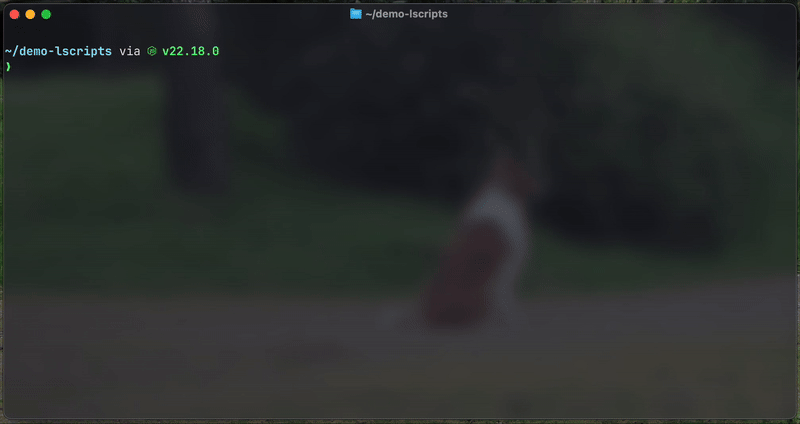

# lscripts

Command to list all the scripts in your `package.json`. Pick easely wich one you want to run, it will be copied to your clipboard!



## Install

With your favourite package manager you can install the package globaly using the git repo web URL.

``` bash
# using npm
npm install -g https://github.com/julesfrn/lscripts.git

# using yarn
yarn global add https://github.com/julesfrn/lscripts.git
```

## Use

Simply run:
``` bash
lscripts
```

You can then pick the script you want to copy to your clipboard using `Up` or `Down` keyes or by typing the name of your script and pressing `Enter`.
The package will then copy the script to your clipboard and you can paste it in your terminal. It determines the package manager you are using checking if you have a `package-lock` or a `yarn-lock` file in your project to copy the proper command to your clipboard.
